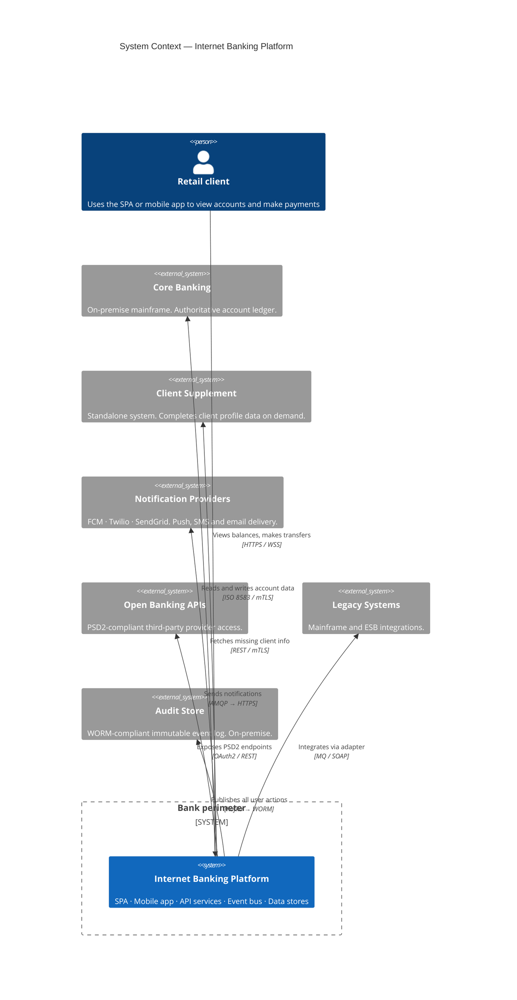
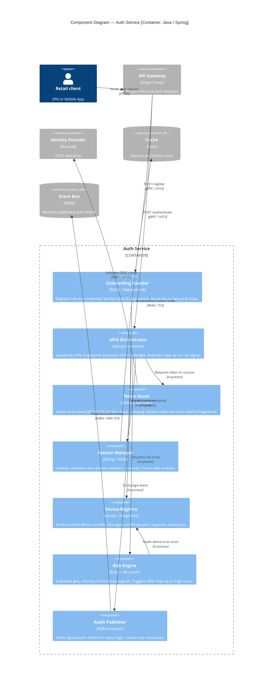
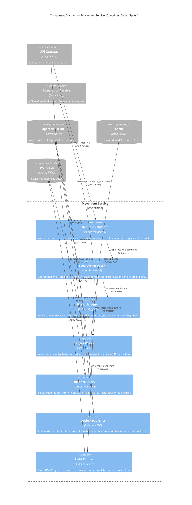
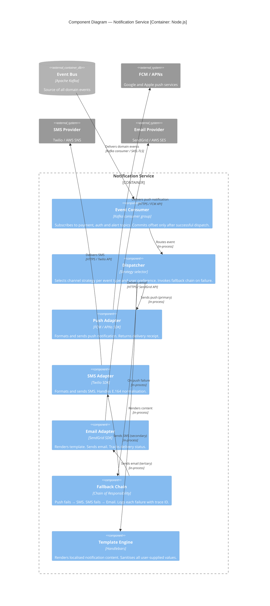
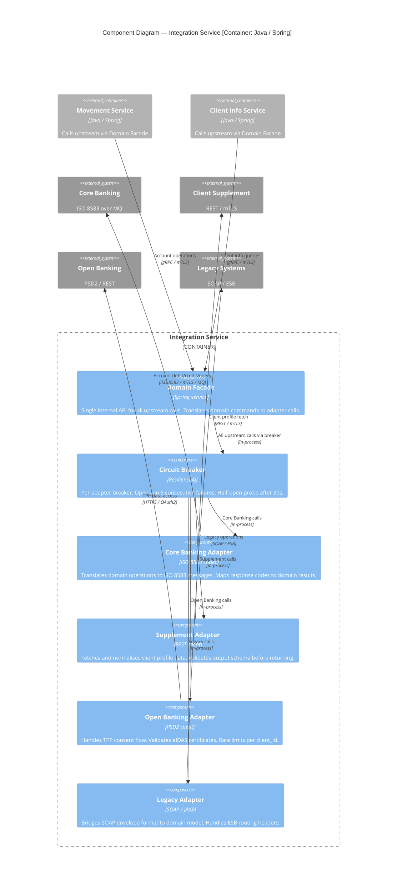

# Internet Banking System — C4 Architecture Document

**Version:** 1.0  
**Classification:** Confidential — Internal Use Only  
**Scale:** Large bank, 1M+ users, multi-region  
**Infrastructure:** Hybrid cloud / on-premise  
**Architecture style:** Event-driven microservices (CQRS)  
**Compliance:** PCI-DSS · SOC 2 · ISO 27001 · PSD2  

---

## Table of Contents

1. [System Context — Level 1](#1-system-context--level-1)
2. [Container Diagram — Level 2](#2-container-diagram--level-2)
3. [Component Diagrams — Level 3](#3-component-diagrams--level-3)
   - 3.1 [Auth Service](#31-auth-service)
   - 3.2 [Movement Service](#32-movement-service)
   - 3.3 [Notification Service](#33-notification-service)
   - 3.4 [Integration Service](#34-integration-service)
4. [Architectural Decision Records](#4-architectural-decision-records)
5. [Security Model by Level](#5-security-model-by-level)
6. [Design Patterns](#6-design-patterns)
7. [Compliance Mapping](#7-compliance-mapping)
8. [Observability & SLOs](#8-observability--slos)

---

## 1. System Context — Level 1

Defines the system boundary, all actors, and external systems. Every element outside the bank perimeter boundary is treated as untrusted.

### Key decisions at this level

| Decision | Rationale |
|---|---|
| Zero Trust perimeter | All calls authenticated regardless of network origin. Required by PCI-DSS v4.0 Req. 1 and ISO 27001 A.13. |
| Active-active multi-region | RTO < 30s, geo-latency < 50ms. Active-passive wastes 50% capacity and has 2–15 min failover. |
| PII stays on-premise | Data residency regulation. Cloud tier holds tokenised references only. |
| All external comms over TLS 1.3 | Eliminates weak cipher suites by design. HSTS with 2-year max-age deployed at CDN. |

---

## 2. Container Diagram — Level 2

Zooms into the platform boundary showing all deployable units, their technology, and primary communication protocols.

```mermaid
C4Container
  title Container Diagram — Internet Banking Platform

  Person(client, "Retail client", "Uses SPA or mobile app")

  System_Ext(core, "Core Banking", "On-premise. ISO 8583 over MQ.")
  System_Ext(supplement, "Client Supplement", "REST / mTLS.")
  System_Ext(notif_providers, "Notification Providers", "FCM · Twilio · SendGrid")
  System_Ext(idp, "Identity Provider", "Keycloak / Azure AD. OIDC.")

  System_Boundary(platform, "Internet Banking Platform") {

    Container(spa, "SPA", "React / TypeScript", "Browser-based client. Served via CDN.")
    Container(mobile, "Mobile App", "Flutter", "iOS and Android. FIDO2 onboarding. Certificate pinning.")
    Container(gateway, "API Gateway", "Kong / Envoy", "TLS termination. JWT validation. Rate limiting. mTLS to services.")
    Container(auth, "Auth Service", "Java / Spring", "FIDO2 registration. MFA orchestration. JWT issuance. Session management.")
    Container(movement, "Movement Service", "Java / Spring", "Transfers, payments, balance queries. Saga orchestrator. Transactional outbox.")
    Container(notification, "Notification Service", "Node.js", "Consumes events. Dispatches push, SMS and email via Strategy pattern.")
    Container(integration, "Integration Service", "Java / Spring", "Anti-Corruption Layer. Adapters for Core Banking, Supplement, Legacy and Open Banking.")
    Container(audit_svc, "Audit Service", "Java / Spring", "Consumes all domain events. Enriches, signs and writes to WORM store.")
    ContainerDb(opsdb, "Operational DB", "PostgreSQL HA", "Write model. Double-entry ledger. ACID. Synchronous replication.")
    ContainerDb(cache, "Cache", "Redis Cluster", "Read model and session store. Cache-Aside pattern. TTL eviction.")
    ContainerDb(eventbus, "Event Bus", "Apache Kafka", "Async backbone. Transactional Outbox relay. SASL/TLS. Schema registry.")
    ContainerDb(auditstore, "Audit Store", "Kafka + WORM", "Append-only. HMAC-signed events. On-premise. 12-month retention.")
    ContainerDb(secrets, "Secrets Store", "HashiCorp Vault / HSM", "Dynamic secrets. PKI for mTLS certs. Envelope encryption keys.")
  }

  Rel(client, spa, "Uses", "HTTPS")
  Rel(client, mobile, "Uses", "HTTPS / cert-pinned")
  Rel(spa, gateway, "API calls", "HTTPS")
  Rel(mobile, gateway, "API calls", "HTTPS / TLS 1.3")
  Rel(gateway, auth, "Routes auth requests", "gRPC / mTLS")
  Rel(gateway, movement, "Routes payment requests", "gRPC / mTLS")
  Rel(gateway, integration, "Routes upstream queries", "gRPC / mTLS")
  Rel(auth, idp, "Delegates OIDC flow", "OIDC / HTTPS")
  Rel(auth, cache, "Reads/writes sessions", "Redis protocol / TLS")
  Rel(movement, opsdb, "Writes ledger entries", "JDBC / TLS")
  Rel(movement, cache, "Reads balance (Cache-Aside)", "Redis protocol / TLS")
  Rel(movement, eventbus, "Publishes via outbox", "Kafka / SASL-TLS")
  Rel(eventbus, notification, "Delivers domain events", "Kafka consumer")
  Rel(eventbus, audit_svc, "Delivers all events", "Kafka consumer")
  Rel(notification, notif_providers, "Dispatches notifications", "HTTPS")
  Rel(audit_svc, auditstore, "Writes signed events", "Kafka / WORM")
  Rel(integration, core, "Account operations", "ISO 8583 / mTLS")
  Rel(integration, supplement, "Client info queries", "REST / mTLS")
  Rel(secrets, auth, "Issues signing keys", "Vault API / mTLS")
  Rel(secrets, movement, "Issues DB credentials", "Vault API / mTLS")

  UpdateLayoutConfig($c4ShapeInRow="4", $c4BoundaryInRow="1")
```

### Container technology decisions

| Container | Technology | Justification |
|---|---|---|
| API Gateway | Kong / Envoy | Hybrid-deployable. Istio service mesh mTLS without code changes. Vendor-neutral for 10+ year lifecycle. |
| Event Bus | Apache Kafka | Log retention for compliance replay. Consumer group fan-out. Required for Transactional Outbox pattern. |
| Mobile App | Flutter | Single codebase eliminates dual-stack auth implementation risk. Compiles to native ARM — no JS bridge. |
| Operational DB | PostgreSQL HA | ACID for double-entry ledger. On-prem deployable. Full DBA control over query plans and retention. |
| Secrets Store | HashiCorp Vault + HSM | Dynamic short-lived credentials. HSM as root of trust for FIDO2, JWT signing, and HMAC keys. |
| Cache | Redis Cluster | Cache-Aside pattern for read model. Sub-10ms hot-path reads. Write-through invalidation on balance events. |

---

## 3. Component Diagrams — Level 3

### 3.1 Auth Service

Orchestrates the full authentication lifecycle: FIDO2/Face ID onboarding, PIN/fingerprint/password login, token issuance, and session management.

#### Auth token specification

| Parameter | Value | Rationale |
|---|---|---|
| Access token TTL | 15 minutes | Limits breach window. Aligns with PCI-DSS Req. 8.2.9 idle timeout. |
| Refresh token TTL | 8 hours | Bound to device fingerprint + IP subnet. Rotated on every use. |
| Signing algorithm | RS256 | Asymmetric — verifiers hold public key only. HS256 shares secret with every consumer. |
| Key rotation | 90-day cycle | Vault PKI engine. Zero-downtime via overlapping `kid` header. |
| Claims | sub, scope, device_id, region | No PII in token body. Account data fetched via API, never embedded in JWT. |

---

### 3.2 Movement Service

Handles all financial movements using the Saga pattern for distributed transactions and the Transactional Outbox for reliable event publishing.

---

### 3.3 Notification Service

Consumes domain events from Kafka and dispatches to Push, SMS, and Email channels using the Strategy + Chain of Responsibility patterns.

---

### 3.4 Integration Service

Anti-Corruption Layer isolating the domain model from all upstream system protocols. Each upstream system has a dedicated adapter.

---

## 4. Architectural Decision Records

### ADR-001 — Event-driven microservices over modular monolith

**Status:** Accepted

**Context:** 1M+ users across multiple regions, hybrid infrastructure, multiple upstream systems with different SLAs.

**Decision:** Event-driven microservices with Kafka as the central event bus. Synchronous gRPC for latency-sensitive internal calls.

**Rationale:**
- Independent scaling per service. Movement Service peaks during business hours; Notification Service peaks on payment completion.
- Fault isolation prevents a Core Banking timeout from affecting the SPA.
- Kafka enables replay, audit trail, and CQRS read models without coupling producers to consumers.

**Consequences:** Higher operational complexity. Requires distributed tracing (OpenTelemetry), schema registry (Confluent), and idempotency discipline across all services.

---

### ADR-002 — FIDO2/WebAuthn for onboarding; OIDC + JWT for sessions

**Status:** Accepted

**Context:** Mobile onboarding via Face ID. Subsequent logins via PIN, fingerprint, or password. Must satisfy PCI-DSS, SOC 2, and ISO 27001.

**Decision:** FIDO2/WebAuthn for initial device registration and biometric binding. OIDC authorization code flow (PKCE) for session establishment. Short-lived JWT access tokens (15 min) + rotating refresh tokens (8h, bound to device fingerprint). Certificate pinning on mobile.

**Rationale:**
- FIDO2 eliminates shared secrets during onboarding. Private key never leaves the device Secure Enclave.
- PKCE prevents token interception on mobile.
- Rotating refresh tokens limit blast radius of token theft.
- SMS OTP alternative is vulnerable to SIM-swap and SS7 interception — documented active threats in LatAm.

**Consequences:** Requires device management for key revocation. Lost/stolen device recovery must be a separate out-of-band re-onboarding flow.

---

### ADR-003 — Saga pattern + Transactional Outbox for financial movements

**Status:** Accepted

**Context:** Financial transactions span Movement Service, Core Banking adapter, and Notification Service. Classic 2PC is unavailable across hybrid boundaries.

**Decision:** Orchestration-based Saga for multi-step payments. Transactional Outbox pattern ensures the domain event is persisted atomically with the ledger write before being published to Kafka.

**Rationale:**
- 2PC requires all participants to implement XA transactions. Core Banking (ISO 8583 over MQ) does not support XA.
- The Outbox relay guarantees at-least-once delivery with idempotency keys at the consumer side.
- Saga compensating transactions handle partial failures without distributed locks.

**Consequences:** Eventual consistency for balance reads. UX must expose a "pending" state. Requires idempotency key management on all movement endpoints.

---

### ADR-004 — CQRS + Cache-Aside (Redis) for frequent-user data

**Status:** Accepted

**Context:** Pre-loaded balances, recent transactions, and favourite payees for frequent users. Must not couple to Core Banking on every SPA load.

**Decision:** CQRS write model in PostgreSQL. Read model in MongoDB/Elasticsearch populated by Kafka consumers. Redis Cache-Aside layer in front of the read model for sub-10ms hot-path reads. TTL-based eviction with event-driven invalidation on balance changes.

**Rationale:**
- Typical banking read:write ratio is 95:5. The write model (ACID, locking) and read model (fast retrieval, denormalised) have incompatible optimisation targets.
- Cache-Aside chosen over Read-Through because the cache-warming logic requires enrichment from multiple Kafka topics — not a simple DB fetch.
- Cache stampede mitigated via probabilistic early expiration (PER algorithm).

**Consequences:** Read model is eventually consistent (~100–500ms lag). UX must show "as of" timestamps. Cache invalidation on balance-affecting events must be reliable.

---

### ADR-005 — Anti-Corruption Layer for all upstream integrations

**Status:** Accepted

**Context:** Core Banking uses ISO 8583. Supplement uses REST. Open Banking uses PSD2 REST. Legacy uses SOAP/ESB. Each has different error models and data shapes.

**Decision:** Integration Service acts as a single ACL boundary. Each upstream has a dedicated Adapter translating to/from the internal domain model. A Domain Facade presents a unified API to other services.

**Rationale:**
- Without the ACL, ISO 8583 field codes (DE2, DE39, DE49) appear in domain model objects throughout the application.
- When Core Banking is upgraded, only the adapter changes — not every service that called it.
- The ACL boundary is a natural security control: all upstream input is validated and sanitised in the adapter before entering the domain.

**Consequences:** Additional service hop mitigated by gRPC + Istio service mesh. Adapter mappings must be maintained as upstream systems evolve.

---

### ADR-006 — Hybrid cloud with active-active multi-region deployment

**Status:** Accepted

**Context:** Regulatory requirement to keep certain data on-premise. Need for global low latency and elastic scaling.

**Decision:** Cloud-hosted stateless services (API Gateway, microservices, Kafka, Redis) in 3+ regions active-active. On-premise: Core Banking, HSM/Vault, WORM audit storage, PII database. PostgreSQL synchronous replication within region; asynchronous cross-region with RPO < 1 min. Kafka MirrorMaker 2 for cross-region topic replication.

**Rationale:**
- Satisfies data residency regulations (PII on-prem).
- Meets < 200ms latency SLA at global scale.
- Provides regional failover with RTO < 30s for the cloud tier.

**Consequences:** Network latency between cloud services and on-prem Core Banking must be managed over a private WAN link. On-prem systems remain the single source of truth for the account ledger.

---

## 5. Security Model by Level

| Level | Threat surface | Controls | Protocol |
|---|---|---|---|
| L1 — Perimeter | Public internet, DDoS, scraping | WAF · CDN · rate limiting · geo-blocking · bot score | TLS 1.3 minimum |
| L2 — API Gateway | Token forgery, replay, injection | JWT validation · PKCE · request signing · input schema validation · CORS policy | HTTPS + mTLS (service mesh) |
| L2 — Auth container | Credential theft, brute force, SIM-swap | FIDO2 device binding · OTP rate limit · risk scoring · anomaly detection · cert pinning | FIDO2 / OIDC / JWT RS256 |
| L2 — Event Bus | Message tampering, topic sprawl | Kafka ACLs · TLS in transit · schema registry enforcement · signed event envelope | Kafka TLS + SASL/SCRAM |
| L3 — Movement Svc | Double-spend, amount tampering | Idempotency keys · HMAC-signed amounts · 4-eyes for high-value · ledger ACID | gRPC / mTLS (internal) |
| L3 — Integration ACL | Upstream injection, data exfiltration | Input/output sanitisation in adapters · circuit breaker · mTLS to all upstream · Vault-managed secrets | ISO 8583 / REST / SOAP via private WAN |
| L3 — Audit Svc | Log tampering, incomplete audit trail | WORM storage · HMAC-signed events · dual-write to cold WORM bucket · retention policy enforcement | Kafka TLS → append-only store |
| Data at rest | DB breach, backup exfiltration | AES-256-GCM column encryption for PII · TDE for PostgreSQL · Vault KMS key rotation · Redis AUTH + TLS | AES-256 / TDE |
| Mobile specific | Reverse engineering, MITM | Certificate pinning (SPKI hash) · jailbreak/root detection · Secure Enclave for FIDO2 keys · screenshot prevention | TLS 1.3 + cert pinning |

### STRIDE threat mapping

| STRIDE category | Banking-specific threat | Primary control |
|---|---|---|
| Spoofing | Fake client identity; stolen token reuse | FIDO2 device binding; JWT device_id claim validation; certificate pinning |
| Tampering | Payment amount modification in transit; audit log alteration | TLS 1.3; HMAC-signed transaction amounts; WORM audit store |
| Repudiation | User denies initiating a payment; insider denies record access | Signed audit events with device context; FIDO2 user verification |
| Info Disclosure | Account number in logs; token in URL | PAN tokenisation in all logs; Bearer token in Authorization header only; no PII in JWT |
| Denial of Service | DDoS on payment endpoint; thread exhaustion | WAF + CDN rate limiting; circuit breaker; async heavy processing |
| Elevation of Privilege | IDOR to another user's account; service account escalation | JWT scope validation per endpoint; RBAC on service accounts; Vault least-privilege |

---

## 6. Design Patterns

| Pattern | Used in | Problem solved |
|---|---|---|
| **Saga (Orchestration)** | Movement Service | Distributed transaction across hybrid boundary without 2PC or XA. Compensating transactions on step failure. |
| **Transactional Outbox** | Movement Service | Atomic write of ledger entry and Kafka event in one DB transaction. Eliminates dual-write problem. |
| **CQRS** | Movement Service + Cache | Decouples read scaling (Redis + MongoDB) from write scaling (PostgreSQL). 95:5 read:write ratio demands this separation. |
| **Cache-Aside** | Movement Service + Auth | Event-driven cache population. Warming logic requires multi-source enrichment incompatible with Read-Through. |
| **Anti-Corruption Layer** | Integration Service | Prevents ISO 8583, SOAP, and PSD2 models leaking into the domain. Isolates upstream protocol changes. |
| **Adapter** | Integration Service | One adapter per upstream system. Translates protocol and data model independently. |
| **Circuit Breaker** | Integration Service | Prevents cascade failure from Core Banking latency spikes. Sheds load during outage window. |
| **Strategy** | Notification Service | Each notification channel is an interchangeable strategy. New channels added without touching the Dispatcher. |
| **Chain of Responsibility** | Notification Service | Push → SMS → Email fallback chain. Fallback order configurable without rewriting business logic. |
| **Event Sourcing** | Audit Service only | Append-only audit trail. Replayable from any point in time. WORM + HMAC provides tamper evidence. |
| **Facade** | Integration Service | Single clean internal API hides adapter complexity from all consuming services. |

---

## 7. Compliance Mapping

| Framework | Key requirement | Architectural control |
|---|---|---|
| PCI-DSS v4.0 Req. 1 | Network security controls | mTLS service mesh (Istio); WAF at perimeter; Kubernetes NetworkPolicy; no unrestricted east-west traffic |
| PCI-DSS v4.0 Req. 3.5 | Protect stored PAN | AES-256-GCM column encryption; Vault HSM as root of trust; tokenisation for non-payment systems |
| PCI-DSS v4.0 Req. 6.4 | Web-facing app protection | WAF with OWASP rule set; API schema validation at gateway; SAST/DAST in CI pipeline |
| PCI-DSS v4.0 Req. 8.2 | User authentication | FIDO2 + MFA; 15-min session timeout; account lockout after 6 failed attempts |
| PCI-DSS v4.0 Req. 10.2 | Audit log content | Enriched events capture: user ID, event type, datetime, success/failure, source IP, affected resource |
| PCI-DSS v4.0 Req. 10.5 | Protect audit logs | WORM storage; HMAC signing; separate audit DB credentials; dual-write to cold WORM bucket |
| SOC 2 — Availability | 99.99% uptime | Multi-region active-active; RTO < 30s; synthetic probes every 30s |
| SOC 2 — Confidentiality | Data protection | mTLS everywhere; AES-256 at rest; Vault key rotation; PII tokenisation |
| ISO 27001 A.9 | Access control | OIDC/RBAC; device registry; Vault least-privilege secrets; service account scoping |
| ISO 27001 A.12.4 | Logging and monitoring | OpenTelemetry traces; Kafka tamper-evident log; Prometheus + Loki alerting pipeline |
| PSD2 / SCA | Strong customer authentication | FIDO2 + MFA; OAuth2 consent; Open Banking Adapter ACL; rate limiting on TPP endpoints |
| Data residency | PII on-premise | PII stays in on-prem PostgreSQL + HSM. Cloud tier holds tokenised references only. |

---

## 8. Observability & SLOs

### Service Level Objectives

| SLO | Target | Measurement | Alert threshold |
|---|---|---|---|
| Payment API p99 latency | < 800ms | OpenTelemetry span duration | > 1000ms for 5 min |
| Auth service availability | 99.99% / month | Synthetic probes every 30s | 2 consecutive probe failures |
| Payment saga failure rate | < 0.1% | Kafka consumer lag + saga state machine | > 0.1% in 10-min window |
| Notification delivery rate (push) | > 98% | FCM/APNs delivery receipts | < 96% for 5 min |
| Core Banking circuit breaker | CLOSED 99.9% | Resilience4j metrics → Prometheus | OPEN state > 60 seconds |
| Audit event lag (Kafka → WORM) | < 5 seconds | Kafka consumer lag metric | Lag > 10,000 messages |

### Observability stack

| Pillar | Tool | Scope |
|---|---|---|
| Distributed tracing | OpenTelemetry + Jaeger/Tempo | W3C TraceContext propagated through gRPC calls and Kafka message headers |
| Metrics | Prometheus + Grafana | Per-service RED metrics; circuit breaker state; cache hit rate; Kafka consumer lag |
| Logs | Loki + structured JSON | Correlation ID on every log line matches OpenTelemetry trace ID |
| Synthetic monitoring | Blackbox exporter | Auth, payment, and balance endpoints probed every 30s from each region |
| Chaos engineering | Chaos Monkey + Istio fault injection | Quarterly Chaos Days: Core Banking timeout spike, Redis eviction, Kafka broker failure, cross-region partition |

---

*Document owner: Platform Architecture Team*  
*Review cycle: Quarterly or on any ADR change*  
*Next review: See repository CHANGELOG*
