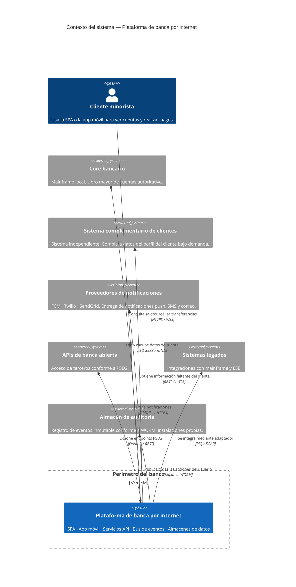
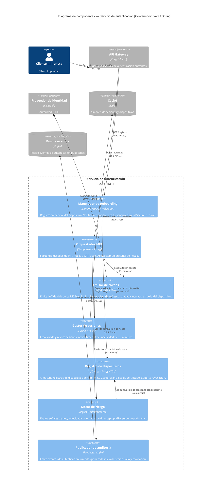
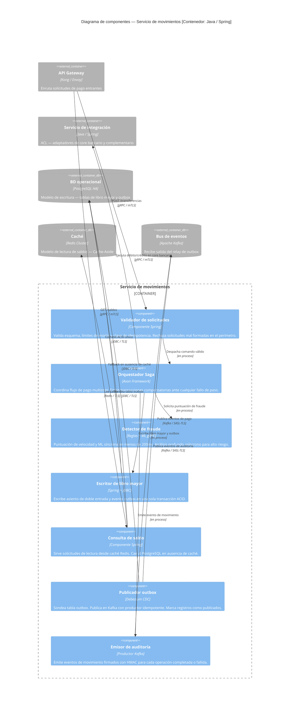
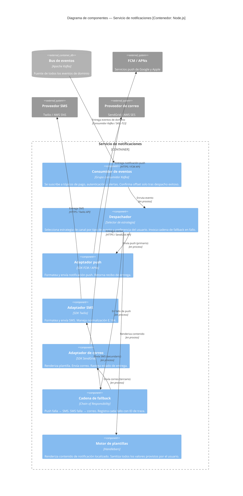
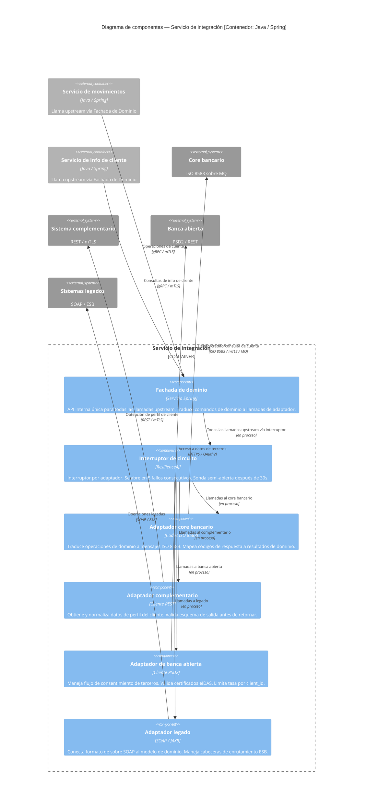

# Sistema de Banca por Internet — Documento de Arquitectura C4

**Versión:** 1.0  
**Clasificación:** Confidencial — Solo uso interno  
**Escala:** Banco grande, más de 1 millón de usuarios, multirregional  
**Infraestructura:** Nube híbrida / instalaciones propias  
**Estilo de arquitectura:** Microservicios orientados a eventos (CQRS)  
**Cumplimiento normativo:** PCI-DSS · SOC 2 · ISO 27001 · PSD2  

---

## Tabla de contenido

1. [Contexto del sistema — Nivel 1](#1-contexto-del-sistema--nivel-1)
2. [Diagrama de contenedores — Nivel 2](#2-diagrama-de-contenedores--nivel-2)
3. [Diagramas de componentes — Nivel 3](#3-diagramas-de-componentes--nivel-3)
   - 3.1 [Servicio de autenticación](#31-servicio-de-autenticación)
   - 3.2 [Servicio de movimientos](#32-servicio-de-movimientos)
   - 3.3 [Servicio de notificaciones](#33-servicio-de-notificaciones)
   - 3.4 [Servicio de integración](#34-servicio-de-integración)
4. [Registros de decisiones arquitectónicas](#4-registros-de-decisiones-arquitectónicas)
5. [Modelo de seguridad por nivel](#5-modelo-de-seguridad-por-nivel)
6. [Patrones de diseño](#6-patrones-de-diseño)
7. [Mapeo de cumplimiento normativo](#7-mapeo-de-cumplimiento-normativo)
8. [Observabilidad y SLOs](#8-observabilidad-y-slos)

---

## 1. Contexto del sistema — Nivel 1

Define el límite del sistema, todos los actores y los sistemas externos. Todo elemento fuera del perímetro del banco se trata como no confiable.

### Decisiones clave en este nivel

| Decisión | Justificación |
|---|---|
| Perímetro de confianza cero | Todas las llamadas se autentican sin importar el origen de red. Requerido por PCI-DSS v4.0 Req. 1 e ISO 27001 A.13. |
| Multirregional activo-activo | RTO < 30s, latencia geográfica < 50ms. El modelo activo-pasivo desperdicia el 50% de la capacidad y tiene failover de 2 a 15 minutos. |
| PII se mantiene en instalaciones propias | Regulación de residencia de datos. La capa en nube solo contiene referencias tokenizadas. |
| Todas las comunicaciones externas sobre TLS 1.3 | Elimina por diseño las suites de cifrado débiles. HSTS con max-age de 2 años desplegado en el CDN. |

---

## 2. Diagrama de contenedores — Nivel 2

Amplía el límite de la plataforma mostrando todas las unidades desplegables, su tecnología y los protocolos de comunicación principales.

```mermaid
C4Container
  title Diagrama de contenedores — Plataforma de banca por internet

  Person(client, "Cliente minorista", "Usa la SPA o la app móvil")

  System_Ext(core, "Core bancario", "Instalaciones propias. ISO 8583 sobre MQ.")
  System_Ext(supplement, "Sistema complementario", "REST / mTLS.")
  System_Ext(notif_providers, "Proveedores de notificaciones", "FCM · Twilio · SendGrid")
  System_Ext(idp, "Proveedor de identidad", "Keycloak / Azure AD. OIDC.")

  System_Boundary(platform, "Plataforma de banca por internet") {

    Container(spa, "SPA", "React / TypeScript", "Cliente en navegador. Servido vía CDN.")
    Container(mobile, "App móvil", "Flutter", "iOS y Android. Onboarding con FIDO2. Anclaje de certificados.")
    Container(gateway, "API Gateway", "Kong / Envoy", "Terminación TLS. Validación JWT. Limitación de tasa. mTLS a servicios.")
    Container(auth, "Servicio de autenticación", "Java / Spring", "Registro FIDO2. Orquestación MFA. Emisión JWT. Gestión de sesiones.")
    Container(movement, "Servicio de movimientos", "Java / Spring", "Transferencias, pagos, consultas de saldo. Orquestador Saga. Outbox transaccional.")
    Container(notification, "Servicio de notificaciones", "Node.js", "Consume eventos. Despacha push, SMS y correo mediante patrón Strategy.")
    Container(integration, "Servicio de integración", "Java / Spring", "Capa anticorrupción. Adaptadores para core bancario, complementario, legado y banca abierta.")
    Container(audit_svc, "Servicio de auditoría", "Java / Spring", "Consume todos los eventos de dominio. Enriquece, firma y escribe en almacén WORM.")
    ContainerDb(opsdb, "BD operacional", "PostgreSQL HA", "Modelo de escritura. Libro mayor de doble entrada. ACID. Replicación síncrona.")
    ContainerDb(cache, "Caché", "Redis Cluster", "Modelo de lectura y almacén de sesiones. Patrón Cache-Aside. Expiración por TTL.")
    ContainerDb(eventbus, "Bus de eventos", "Apache Kafka", "Columna vertebral asíncrona. Relay de Outbox transaccional. SASL/TLS. Registro de esquemas.")
    ContainerDb(auditstore, "Almacén de auditoría", "Kafka + WORM", "Solo anexar. Eventos firmados con HMAC. Instalaciones propias. Retención 12 meses.")
    ContainerDb(secrets, "Almacén de secretos", "HashiCorp Vault / HSM", "Secretos dinámicos. PKI para certificados mTLS. Claves de cifrado en sobre.")
  }

  Rel(client, spa, "Usa", "HTTPS")
  Rel(client, mobile, "Usa", "HTTPS / certificado anclado")
  Rel(spa, gateway, "Llamadas API", "HTTPS")
  Rel(mobile, gateway, "Llamadas API", "HTTPS / TLS 1.3")
  Rel(gateway, auth, "Enruta solicitudes de autenticación", "gRPC / mTLS")
  Rel(gateway, movement, "Enruta solicitudes de pago", "gRPC / mTLS")
  Rel(gateway, integration, "Enruta consultas upstream", "gRPC / mTLS")
  Rel(auth, idp, "Delega flujo OIDC", "OIDC / HTTPS")
  Rel(auth, cache, "Lee/escribe sesiones", "Protocolo Redis / TLS")
  Rel(movement, opsdb, "Escribe asientos en libro mayor", "JDBC / TLS")
  Rel(movement, cache, "Lee saldo (Cache-Aside)", "Protocolo Redis / TLS")
  Rel(movement, eventbus, "Publica vía outbox", "Kafka / SASL-TLS")
  Rel(eventbus, notification, "Entrega eventos de dominio", "Consumidor Kafka")
  Rel(eventbus, audit_svc, "Entrega todos los eventos", "Consumidor Kafka")
  Rel(notification, notif_providers, "Despacha notificaciones", "HTTPS")
  Rel(audit_svc, auditstore, "Escribe eventos firmados", "Kafka / WORM")
  Rel(integration, core, "Operaciones de cuenta", "ISO 8583 / mTLS")
  Rel(integration, supplement, "Consultas de información de cliente", "REST / mTLS")
  Rel(secrets, auth, "Emite claves de firma", "Vault API / mTLS")
  Rel(secrets, movement, "Emite credenciales de BD", "Vault API / mTLS")

  UpdateLayoutConfig($c4ShapeInRow="4", $c4BoundaryInRow="1")
```

### Decisiones tecnológicas por contenedor

| Contenedor | Tecnología | Justificación |
|---|---|---|
| API Gateway | Kong / Envoy | Desplegable en entorno híbrido. mTLS con Istio sin cambios de código. Sin dependencia de proveedor para ciclo de vida de 10+ años. |
| Bus de eventos | Apache Kafka | Retención de log para replay de cumplimiento. Fan-out por grupos de consumidores. Necesario para el patrón Outbox transaccional. |
| App móvil | Flutter | Una sola base de código elimina el riesgo de implementación duplicada de la autenticación crítica. Compila a ARM nativo, sin puente JS. |
| BD operacional | PostgreSQL HA | ACID para libro mayor de doble entrada. Desplegable en instalaciones propias. Control total de planes de consulta y retención. |
| Almacén de secretos | HashiCorp Vault + HSM | Credenciales dinámicas de vida corta. HSM como raíz de confianza para FIDO2, firma JWT y claves HMAC. |
| Caché | Redis Cluster | Patrón Cache-Aside para modelo de lectura. Lecturas en ruta caliente bajo 10ms. Invalidación por escritura en eventos de saldo. |

---

## 3. Diagramas de componentes — Nivel 3

### 3.1 Servicio de autenticación

Orquesta el ciclo de vida completo de autenticación: onboarding FIDO2/Face ID, inicio de sesión con PIN/huella/contraseña, emisión de tokens y gestión de sesiones.

#### Especificación del token de autenticación

| Parámetro | Valor | Justificación |
|---|---|---|
| TTL del token de acceso | 15 minutos | Limita la ventana de brecha. Alineado con timeout de inactividad PCI-DSS Req. 8.2.9. |
| TTL del token de refresco | 8 horas | Vinculado a huella del dispositivo + subred IP. Rotado en cada uso. |
| Algoritmo de firma | RS256 | Asimétrico: los verificadores solo tienen clave pública. HS256 comparte secreto con cada consumidor. |
| Rotación de claves | Ciclo de 90 días | Motor PKI de Vault. Sin tiempo de inactividad vía header `kid` superpuesto. |
| Claims | sub, scope, device_id, region | Sin PII en el cuerpo del token. Los datos de cuenta se obtienen vía API, nunca embebidos en JWT. |

---

### 3.2 Servicio de movimientos

Gestiona todos los movimientos financieros usando el patrón Saga para transacciones distribuidas y el Outbox transaccional para la publicación confiable de eventos.

---

### 3.3 Servicio de notificaciones

Consume eventos de dominio de Kafka y los despacha a canales de push, SMS y correo electrónico usando los patrones Strategy y Chain of Responsibility.

---

### 3.4 Servicio de integración

Capa anticorrupción que aísla el modelo de dominio de todos los protocolos de sistemas upstream. Cada sistema upstream tiene un adaptador dedicado.

---

## 4. Registros de decisiones arquitectónicas

### ADR-001 — Microservicios orientados a eventos en lugar de monolito modular

**Estado:** Aceptado

**Contexto:** Más de 1 millón de usuarios en múltiples regiones, infraestructura híbrida, múltiples sistemas upstream con diferentes SLAs.

**Decisión:** Microservicios orientados a eventos con Kafka como bus central de eventos. gRPC síncrono para llamadas internas sensibles a la latencia.

**Justificación:**
- Escalado independiente por servicio. El Servicio de movimientos tiene picos durante el horario comercial; el Servicio de notificaciones tiene picos al completarse pagos.
- El aislamiento de fallos evita que un timeout del core bancario afecte a la SPA.
- Kafka permite replay, rastro de auditoría y modelos de lectura CQRS sin acoplar productores a consumidores.

**Consecuencias:** Mayor complejidad operacional. Requiere trazado distribuido (OpenTelemetry), registro de esquemas (Confluent) y disciplina de idempotencia en todos los servicios.

---

### ADR-002 — FIDO2/WebAuthn para onboarding; OIDC + JWT para sesiones

**Estado:** Aceptado

**Contexto:** Onboarding móvil vía Face ID. Inicios de sesión posteriores vía PIN, huella o contraseña. Debe cumplir PCI-DSS, SOC 2 e ISO 27001.

**Decisión:** FIDO2/WebAuthn para registro inicial de dispositivo y vinculación biométrica. Flujo OIDC de código de autorización (PKCE) para establecimiento de sesión. Tokens de acceso JWT de vida corta (15 min) + tokens de refresco rotativos (8h, vinculados a la huella del dispositivo). Anclaje de certificados en móvil.

**Justificación:**
- FIDO2 elimina secretos compartidos durante el onboarding. La clave privada nunca sale del Secure Enclave del dispositivo.
- PKCE previene la interceptación de tokens en móvil.
- Los tokens de refresco rotativos limitan el radio de impacto de un robo de token.
- La alternativa OTP por SMS es vulnerable a SIM-swap e interceptación SS7, amenazas documentadas y activas en Latinoamérica.

**Consecuencias:** Requiere gestión de dispositivos para revocación de claves. La recuperación por dispositivo perdido o robado debe ser un flujo separado de re-onboarding fuera de banda.

---

### ADR-003 — Patrón Saga + Outbox transaccional para movimientos financieros

**Estado:** Aceptado

**Contexto:** Las transacciones financieras abarcan el Servicio de movimientos, el adaptador del core bancario y el Servicio de notificaciones. El 2PC clásico no está disponible en entornos híbridos.

**Decisión:** Saga basada en orquestación para pagos multistep. El patrón Outbox transaccional garantiza que el evento de dominio se persiste atómicamente junto al asiento del libro mayor antes de publicarse en Kafka.

**Justificación:**
- El 2PC requiere que todos los participantes implementen transacciones XA. El core bancario (ISO 8583 sobre MQ) no soporta XA.
- El relay del Outbox garantiza entrega al menos una vez con claves de idempotencia en el lado del consumidor.
- Las transacciones compensatorias del Saga manejan fallos parciales sin bloqueos distribuidos.

**Consecuencias:** Consistencia eventual para lecturas de saldo. La UX debe exponer un estado "pendiente". Requiere gestión de claves de idempotencia en todos los endpoints de movimientos.

---

### ADR-004 — CQRS + Cache-Aside (Redis) para datos de usuarios frecuentes

**Estado:** Aceptado

**Contexto:** Saldos precargados, transacciones recientes y destinatarios favoritos para usuarios frecuentes. No debe acoplarse al core bancario en cada carga de la SPA.

**Decisión:** Modelo de escritura CQRS en PostgreSQL. Modelo de lectura en MongoDB/Elasticsearch poblado por consumidores Kafka. Capa Cache-Aside de Redis frente al modelo de lectura para lecturas de ruta caliente en menos de 10ms. Expiración por TTL con invalidación orientada a eventos en cambios de saldo.

**Justificación:**
- La relación típica lectura:escritura en banca es 95:5. El modelo de escritura (ACID, bloqueos) y el de lectura (recuperación rápida, desnormalizado) tienen objetivos de optimización incompatibles.
- Cache-Aside elegido sobre Read-Through porque la lógica de calentamiento de caché requiere enriquecimiento de múltiples tópicos Kafka, incompatible con una obtención simple de BD.
- La estampida de caché se mitiga mediante expiración anticipada probabilística (algoritmo PER).

**Consecuencias:** El modelo de lectura tiene consistencia eventual (~100–500ms de retraso). La UX debe mostrar marcas de tiempo "a partir de". La invalidación de caché en eventos de saldo debe ser fiable.

---

### ADR-005 — Capa anticorrupción para todas las integraciones upstream

**Estado:** Aceptado

**Contexto:** El core bancario usa ISO 8583. El complementario usa REST. La banca abierta usa REST PSD2. El legado usa SOAP/ESB. Cada uno tiene diferentes modelos de error y formas de datos.

**Decisión:** El Servicio de integración actúa como un único límite ACL. Cada sistema upstream tiene un Adaptador dedicado que traduce hacia y desde el modelo de dominio interno. Una Fachada de dominio presenta una API unificada a los demás servicios.

**Justificación:**
- Sin la ACL, los códigos de campo ISO 8583 (DE2, DE39, DE49) aparecerían en los objetos del modelo de dominio en toda la aplicación.
- Cuando se actualice el core bancario, solo cambia el adaptador, no todos los servicios que lo llamaban.
- El límite de la ACL es un control de seguridad natural: toda la entrada upstream es validada y sanitizada en el adaptador antes de entrar al dominio.

**Consecuencias:** Salto adicional de servicio mitigado por gRPC + service mesh Istio. Los mapeos de adaptadores deben mantenerse a medida que los sistemas upstream evolucionan.

---

### ADR-006 — Nube híbrida con despliegue multirregional activo-activo

**Estado:** Aceptado

**Contexto:** Requisito regulatorio de mantener ciertos datos en instalaciones propias. Necesidad de baja latencia global y escalado elástico.

**Decisión:** Servicios sin estado alojados en nube (API Gateway, microservicios, Kafka, Redis) en 3+ regiones activo-activo. En instalaciones propias: core bancario, HSM/Vault, almacenamiento WORM de auditoría, base de datos de PII. Replicación síncrona de PostgreSQL dentro de la región; asíncrona entre regiones con RPO < 1 min. Kafka MirrorMaker 2 para replicación de tópicos entre regiones.

**Justificación:**
- Cumple regulaciones de residencia de datos (PII en instalaciones propias).
- Cumple SLA de latencia < 200ms a escala global.
- Proporciona failover regional con RTO < 30s para la capa en nube.

**Consecuencias:** La latencia de red entre los servicios en nube y el core bancario en instalaciones propias debe gestionarse mediante un enlace WAN privado. Los sistemas en instalaciones propias permanecen como fuente única de verdad para el libro mayor de cuentas.

---

## 5. Modelo de seguridad por nivel

| Nivel | Superficie de amenaza | Controles | Protocolo |
|---|---|---|---|
| L1 — Perímetro | Internet público, DDoS, scraping | WAF · CDN · limitación de tasa · bloqueo geográfico · puntuación de bots | TLS 1.3 mínimo |
| L2 — API Gateway | Falsificación de tokens, replay, inyección | Validación JWT · PKCE · firma de solicitudes · validación de esquema · política CORS | HTTPS + mTLS (service mesh) |
| L2 — Contenedor auth | Robo de credenciales, fuerza bruta, SIM-swap | Vinculación de dispositivo FIDO2 · límite de tasa OTP · puntuación de riesgo · detección de anomalías · anclaje de cert | FIDO2 / OIDC / JWT RS256 |
| L2 — Bus de eventos | Manipulación de mensajes, proliferación de tópicos | ACLs Kafka · TLS en tránsito · registro de esquemas · sobre de evento firmado | Kafka TLS + SASL/SCRAM |
| L3 — Servicio de movimientos | Doble gasto, manipulación de montos | Claves de idempotencia · montos firmados con HMAC · aprobación cuatro ojos para alto valor · ACID del libro mayor | gRPC / mTLS (interno) |
| L3 — ACL de integración | Inyección upstream, exfiltración de datos | Sanitización entrada/salida en adaptadores · interruptor de circuito · mTLS a todos los upstream · secretos gestionados por Vault | ISO 8583 / REST / SOAP vía WAN privada |
| L3 — Servicio de auditoría | Manipulación de logs, rastro de auditoría incompleto | Almacenamiento WORM · eventos firmados con HMAC · escritura dual a bucket WORM frío · aplicación de política de retención | Kafka TLS → almacén solo anexar |
| Datos en reposo | Brecha de BD, exfiltración de respaldos | Cifrado de columnas AES-256-GCM para PII · TDE para PostgreSQL · rotación de claves Vault KMS · Redis AUTH + TLS | AES-256 / TDE |
| Específico móvil | Ingeniería inversa, MITM | Anclaje de certificados (hash SPKI) · detección de jailbreak/root · Secure Enclave para claves FIDO2 · prevención de capturas de pantalla | TLS 1.3 + anclaje de cert |

### Mapeo de amenazas STRIDE

| Categoría STRIDE | Amenaza específica de banca | Control principal |
|---|---|---|
| Suplantación | Identidad falsa de cliente; reutilización de token robado | Vinculación de dispositivo FIDO2; validación del claim device_id en JWT; anclaje de certificados |
| Manipulación | Modificación del monto de pago en tránsito; alteración del log de auditoría | TLS 1.3; montos de transacción firmados con HMAC; almacén WORM de auditoría |
| Repudio | Usuario niega haber iniciado un pago; empleado niega acceso a registros | Eventos de auditoría firmados con contexto de dispositivo; verificación de usuario FIDO2 |
| Divulgación de información | Número de cuenta en logs; token en URL | Tokenización de PAN en todos los logs; token Bearer solo en cabecera Authorization; sin PII en JWT |
| Denegación de servicio | DDoS en endpoint de pago; agotamiento de hilos | WAF + limitación de tasa CDN; interruptor de circuito; procesamiento pesado asíncrono |
| Escalada de privilegios | IDOR a la cuenta de otro usuario; escalada de cuenta de servicio | Validación de scope JWT por endpoint; RBAC en cuentas de servicio; Vault con mínimo privilegio |

---

## 6. Patrones de diseño

| Patrón | Usado en | Problema resuelto |
|---|---|---|
| **Saga (Orquestación)** | Servicio de movimientos | Transacción distribuida en entorno híbrido sin 2PC ni XA. Transacciones compensatorias en fallo de paso. |
| **Outbox transaccional** | Servicio de movimientos | Escritura atómica del asiento del libro mayor y el evento Kafka en una transacción de BD. Elimina el problema de escritura dual. |
| **CQRS** | Servicio de movimientos + Caché | Desacopla el escalado de lectura (Redis + MongoDB) del escalado de escritura (PostgreSQL). La relación 95:5 lectura:escritura exige esta separación. |
| **Cache-Aside** | Servicio de movimientos + Auth | Población de caché orientada a eventos. La lógica de calentamiento requiere enriquecimiento de múltiples fuentes, incompatible con Read-Through. |
| **Capa anticorrupción** | Servicio de integración | Evita que ISO 8583, SOAP y modelos PSD2 contaminen el dominio. Aísla los cambios de protocolo upstream. |
| **Adaptador** | Servicio de integración | Un adaptador por sistema upstream. Traduce protocolo y modelo de datos de forma independiente. |
| **Interruptor de circuito** | Servicio de integración | Previene fallos en cascada por picos de latencia del core bancario. Libera carga durante la ventana de interrupción. |
| **Strategy** | Servicio de notificaciones | Cada canal de notificación es una estrategia intercambiable. Se añaden nuevos canales sin modificar el Despachador. |
| **Chain of Responsibility** | Servicio de notificaciones | Cadena de fallback Push → SMS → Correo. El orden de fallback es configurable sin reescribir la lógica de negocio. |
| **Event Sourcing** | Solo Servicio de auditoría | Rastro de auditoría solo anexar. Reponible desde cualquier punto en el tiempo. WORM + HMAC proporciona evidencia de no manipulación. |
| **Fachada** | Servicio de integración | API interna única y limpia oculta la complejidad del adaptador a todos los servicios consumidores. |

---

## 7. Mapeo de cumplimiento normativo

| Marco | Requisito clave | Control arquitectónico |
|---|---|---|
| PCI-DSS v4.0 Req. 1 | Controles de seguridad de red | mTLS service mesh (Istio); WAF en perímetro; NetworkPolicy de Kubernetes; sin tráfico este-oeste irrestricto |
| PCI-DSS v4.0 Req. 3.5 | Proteger PAN almacenado | Cifrado de columnas AES-256-GCM; HSM de Vault como raíz de confianza; tokenización para sistemas no de pago |
| PCI-DSS v4.0 Req. 6.4 | Protección de apps web expuestas | WAF con conjunto de reglas OWASP; validación de esquema API en gateway; SAST/DAST en pipeline CI |
| PCI-DSS v4.0 Req. 8.2 | Autenticación de usuarios | FIDO2 + MFA; timeout de sesión 15 min; bloqueo de cuenta tras 6 intentos fallidos |
| PCI-DSS v4.0 Req. 10.2 | Contenido del log de auditoría | Eventos enriquecidos capturan: ID de usuario, tipo de evento, fecha/hora, éxito/fallo, IP origen, recurso afectado |
| PCI-DSS v4.0 Req. 10.5 | Proteger logs de auditoría | Almacenamiento WORM; firma HMAC; credenciales BD de auditoría separadas; escritura dual a bucket WORM frío |
| SOC 2 — Disponibilidad | 99,99% de uptime | Multirregional activo-activo; RTO < 30s; sondas sintéticas cada 30s |
| SOC 2 — Confidencialidad | Protección de datos | mTLS en todas partes; AES-256 en reposo; rotación de claves Vault; tokenización de PII |
| ISO 27001 A.9 | Control de acceso | OIDC/RBAC; registro de dispositivos; secretos Vault con mínimo privilegio; alcance de cuentas de servicio |
| ISO 27001 A.12.4 | Registro y monitoreo | Trazas OpenTelemetry; log Kafka a prueba de manipulación; pipeline de alertas Prometheus + Loki |
| PSD2 / SCA | Autenticación fuerte del cliente | FIDO2 + MFA; consentimiento OAuth2; ACL adaptador banca abierta; limitación de tasa en endpoints TPP |
| Residencia de datos | PII en instalaciones propias | PII permanece en PostgreSQL + HSM locales. La capa en nube solo contiene referencias tokenizadas. |

---

## 8. Observabilidad y SLOs

### Objetivos de nivel de servicio

| SLO | Objetivo | Medición | Umbral de alerta |
|---|---|---|---|
| Latencia p99 API de pagos | < 800ms | Duración de span OpenTelemetry | > 1000ms por 5 min |
| Disponibilidad del servicio de auth | 99,99% / mes | Sondas sintéticas cada 30s | 2 fallos de sonda consecutivos |
| Tasa de fallo del Saga de pagos | < 0,1% | Lag consumidor Kafka + máquina de estados Saga | > 0,1% en ventana de 10 min |
| Tasa de entrega de notificaciones (push) | > 98% | Recibos de entrega FCM/APNs | < 96% por 5 min |
| Estado del interruptor de circuito del core | CERRADO 99,9% | Métricas Resilience4j → Prometheus | Estado ABIERTO > 60 segundos |
| Retraso evento auditoría (Kafka → WORM) | < 5 segundos | Métrica de lag consumidor Kafka | Lag > 10.000 mensajes |

### Stack de observabilidad

| Pilar | Herramienta | Alcance |
|---|---|---|
| Trazado distribuido | OpenTelemetry + Jaeger/Tempo | W3C TraceContext propagado en llamadas gRPC y cabeceras de mensajes Kafka |
| Métricas | Prometheus + Grafana | Métricas RED por servicio; estado del interruptor; tasa de aciertos de caché; lag de consumidor Kafka |
| Logs | Loki + JSON estructurado | ID de correlación en cada línea de log coincide con ID de traza OpenTelemetry |
| Monitoreo sintético | Blackbox exporter | Endpoints de autenticación, pago y saldo sondeados cada 30s desde cada región |
| Ingeniería del caos | Chaos Monkey + inyección de fallos Istio | Días de caos trimestrales: pico de timeout core bancario, expulsión Redis, fallo de broker Kafka, partición entre regiones |

---

*Propietario del documento: Equipo de Arquitectura de Plataforma*  
*Ciclo de revisión: Trimestral o ante cualquier cambio de ADR*  
*Próxima revisión: Ver CHANGELOG del repositorio*
